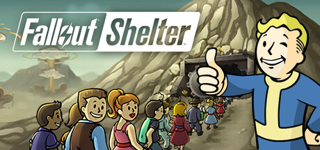
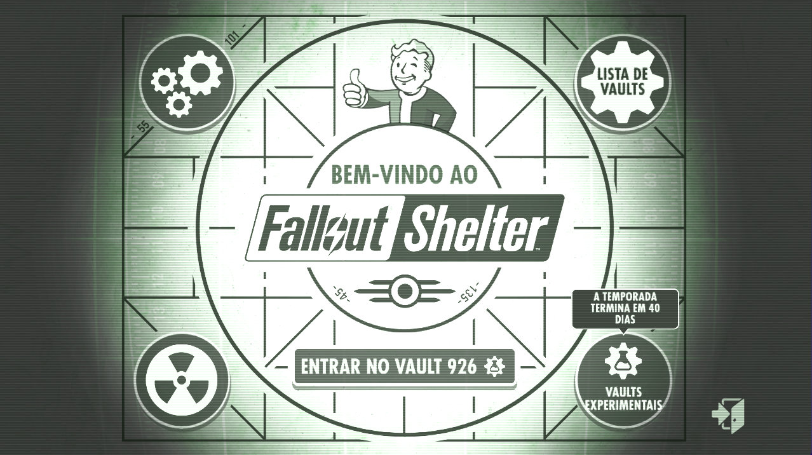
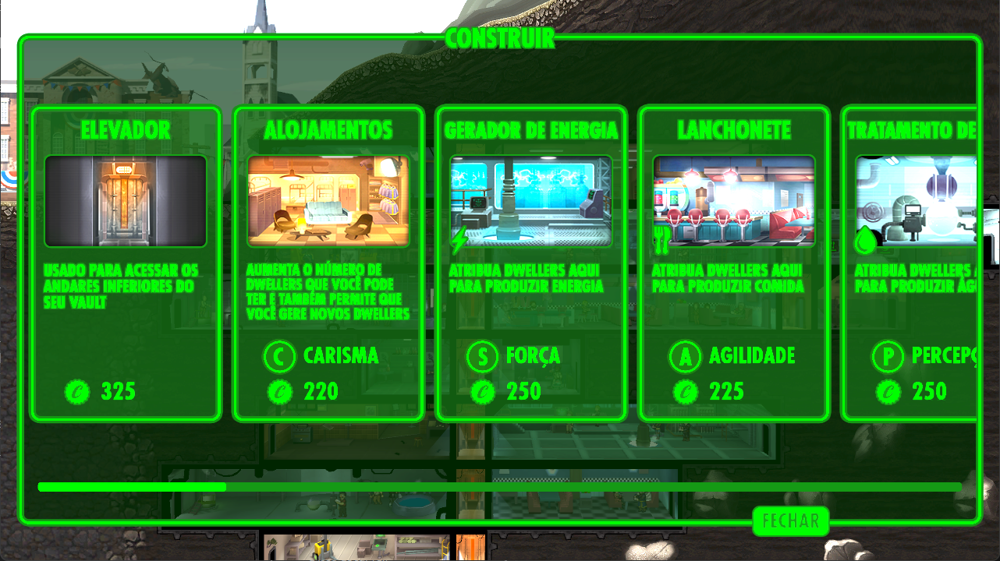

<div align="center">



# Fallout Shelter — Tradução PT-BR 🇧🇷

**Tradução completa para Português do Brasil do Fallout Shelter (Steam/PC).**
Instalador de **1 clique** — sem precisar instalar nada.


-009c3b)


</div>

---

## 📸 Prévia

<div align="center">

&nbsp;

</div>

## ✨ O que tem

- ✅ **14.037 textos** traduzidos — o jogo **inteiro**: menus, salas, quests, itens, moradores e diálogos.
- 🖱️ **Instalador de 1 clique** — não precisa de .NET, ferramentas, nem conhecimento técnico.
- 🌐 **Funciona com qualquer idioma da Steam** — você **não precisa configurar nada**.
- 💾 **Backup automático** — dá pra voltar ao original quando quiser.
- 🎯 Estilo de tradução: termos icônicos do Fallout ficam em inglês (Vault, Dweller, Caps, Stimpak,
  Wasteland…) e todo o resto em português.

## 📥 Como instalar

1. Baixe o **[`Traducao-FalloutShelter-PTBR.zip`](../../releases/latest)** (aba **Releases**).
2. Extraia e dê **2 cliques** em `Traduzir-FalloutShelter-PTBR.exe`.
   - Se o Windows mostrar um aviso azul (*"O Windows protegeu o seu PC"*):
     **Mais informações → Executar assim mesmo**.
   - Na janela de permissão (UAC): **Sim**.
3. Abra o jogo. **Pronto, está em português!** 🎉

> ℹ️ Não precisa mudar o idioma na Steam — a tradução é aplicada em todos os idiomas do jogo,
> então funciona em qualquer configuração.

## 🔄 Voltar para o inglês

Steam → botão direito em **Fallout Shelter** → **Propriedades** → **Arquivos instalados** →
**Verificar integridade dos arquivos**. A Steam restaura o original.

## 🆕 Atualizou o jogo e voltou pro inglês?

Toda atualização da Steam troca o arquivo de textos. É só **rodar o `.exe` de novo**.

## ❓ Perguntas frequentes

<details>
<summary><b>É seguro? Posso tomar ban?</b></summary><br>

Sim, é seguro. O instalador **só edita o arquivo de textos do seu jogo** e faz um **backup**
(`data.unity3d.bak`) antes. É um jogo single-player; não mexe em conta, save online nem anti-cheat.
</details>

<details>
<summary><b>O instalador não achou meu jogo</b></summary><br>

Se você instalou a Steam (ou o jogo) em outro drive, o programa pede para você **colar o caminho**
da pasta `Fallout Shelter`. Cole e tecle ENTER.
</details>

<details>
<summary><b>Apareceram quadradinhos ▯ no lugar de letras</b></summary><br>

É falta de glifo da fonte para algum caractere. Abra uma **issue** com um print que dá pra
adicionar uma fonte de fallback.
</details>

<details>
<summary><b>Por que o Windows diz "Editor desconhecido"?</b></summary><br>

Porque o `.exe` não é assinado digitalmente (assinatura custa caro). É um falso-positivo comum em
programas pequenos. Clique em **Mais informações → Executar assim mesmo**. O código-fonte está
aqui no repositório, se quiser auditar.
</details>

## 🛠️ Para desenvolvedores

<details>
<summary><b>Como funciona / como compilar</b></summary><br>

O Fallout Shelter (PC) usa **I2 Localization**; os textos ficam num MonoBehaviour `LanguageSource`
dentro de `resources.assets`, empacotado no bundle `data.unity3d` (Unity **6000.0.58f2**, backend
Mono). No PC **não há menu de idioma**: `LocalizationManager.SelectStartupLanguage` mapeia o idioma
da Steam para um dos 6 slots e, se não mapear, usa o slot 0 (English). Por isso a tradução é gravada
em **todos os slots** — garante português em qualquer caso.

As ferramentas (C#, precisam do **.NET SDK 8+**) usam
[AssetsTools.NET](https://github.com/nesrak1/AssetsTools.NET) + `classdata.tpk` + **Mono.Cecil**
para ler/reescrever o MonoBehaviour e reempacotar o bundle em LZ4.

| Pasta | Função |
|---|---|
| `exporter/` | Extrai os termos do `data.unity3d` para CSV. |
| `injector/` | Injeta um CSV `Key,texto` de volta no bundle (uso avançado). |
| `patcher/`  | Código-fonte do instalador `.exe` (embute `res/ptbr.csv` + `res/classdata.tpk`). |
| `work/ptbr.csv` | A tradução (Key → pt-BR). **Edite aqui** para corrigir textos. |
| `work/glossario.md` | Regras e glossário de terminologia. |

**Compilar o instalador:**
```bash
dotnet publish patcher -c Release -r win-x64 --self-contained true ^
  -p:PublishSingleFile=true -p:IncludeNativeLibrariesForSelfExtract=true -p:EnableCompressionInSingleFile=true
```
</details>

## ⚖️ Aviso legal

Projeto de **fã**, **sem fins lucrativos** e **sem afiliação** com a Bethesda Softworks / ZeniMax.
O instalador aplica a tradução na **cópia legal do próprio usuário** e **não redistribui** nenhum
arquivo original do jogo. *Fallout*, *Fallout Shelter*, o logotipo e as imagens promocionais são
propriedade da Bethesda/ZeniMax e aparecem aqui apenas para fins ilustrativos. Use por sua conta e
risco — sempre dá pra reverter pela verificação de integridade da Steam.

## 🙏 Créditos

- Tradução e ferramentas: **Lucas Oliveira**
- Bibliotecas: AssetsTools.NET, Mono.Cecil, ILSpy

---

<div align="center">
Gostou? Deixe uma ⭐ no repositório!
</div>
